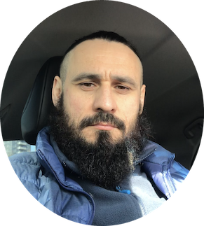

# Oleksii Naumenko

*Rolling Scopes School student* <br><br><br>

### Contact
---
**phone:** &nbsp; +1(888)234-56-78

**email:** &nbsp; *naumenko.aleksey@gmail.com*

**rs-school username:** &nbsp; *@Sfincs2023*

**github:** &nbsp; https://github.com/Sfincs2023
<br><br><br>

### About Me
---
*My primary goal is to become a proficient web developer, focusing on both front-end and back-end. I am dedicated to building interactive, user-friendly web applications and continuously improving my coding skills.*

* __Priorities__  
*__Learning and Growth:__ I am committed to continuous learning and adapting to new technologies.
__Quality__: I strive to write clean, efficient, and maintainable code.
__Problem-Solving:__ I enjoy tackling challenges and finding innovative solutions.*
* __Strengths:__  
*__Analytical Skills:__ My background in economics has honed my ability to analyze data and make informed decisions.
__Adaptability:__ I quickly adapt to new tools, frameworks, and environments.
__Attention to Detail:__ I ensure high-quality output by paying close attention to details.
__Collaboration:__ I work well in team settings, valuing communication and collaboration.*
  <br><br>

### Education
---
*Master’s degree in Economics. 2000 - 2006 __ZGIA.__*
<br><br>

### Experience
---
*While I am currently focused on studying JavaScript and building personal projects, my background in economics provides a solid foundation in analytical thinking and problem-solving. I am actively working on improving my coding skills and applying new concepts through various projects.*  
<br>

### Code
---
Example Solution from &nbsp; https://www.codewars.com:  
```
function updateLight(current) {
  switch(current) {
      case 'red': return 'green';
      case 'yellow': return 'red';
      case 'green': return 'yellow';
  }
}
```  
GitHub project: &nbsp; https://github.com/Sfincs2023/rsschool-cv
<br><br>

### Languages
---
* Ukrainian
* Russian
* English
* Spanish